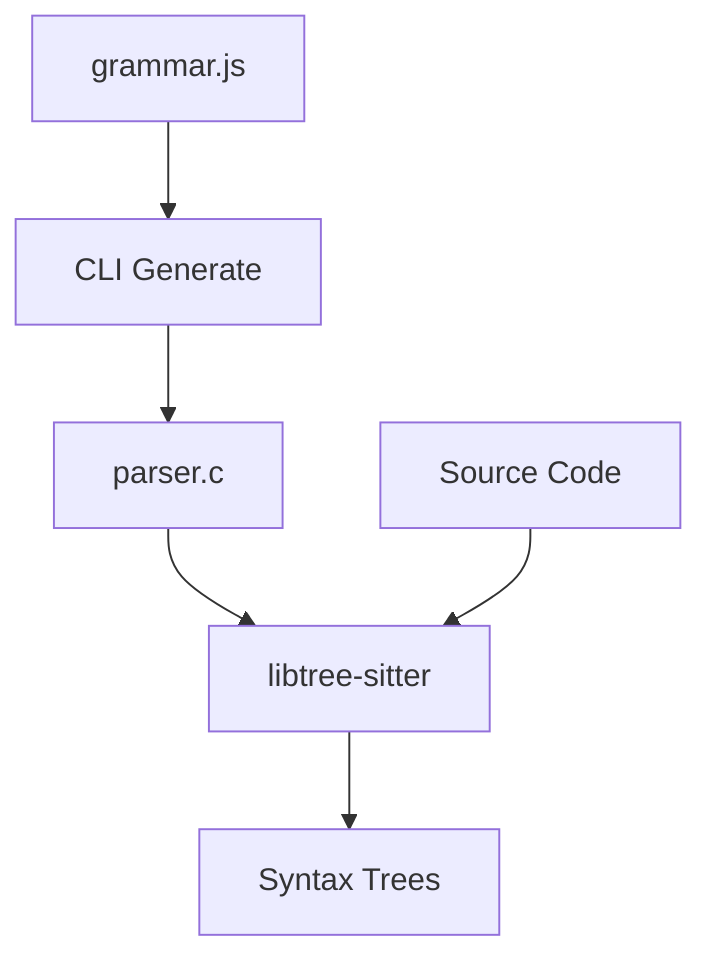

Tree-sitter consists of two main components: a C library (`libtree-sitter`) for runtime parsing, and a Rust-based CLI for parser generation.

## Architecture Overview



## The C Library (libtree-sitter)

The runtime library is written in plain C for maximum portability and embeddability.

### Core API

The public interface is defined in [`tree_sitter/api.h`](https://github.com/tree-sitter/tree-sitter/blob/master/lib/include/tree_sitter/api.h):

```c
// Core types
typedef struct TSParser TSParser;
typedef struct TSTree TSTree;
typedef struct TSNode TSNode;
typedef struct TSLanguage TSLanguage;

// Parser lifecycle
TSParser *ts_parser_new(void);
void ts_parser_delete(TSParser *);
bool ts_parser_set_language(TSParser *, const TSLanguage *);

// Parsing
TSTree *ts_parser_parse_string(
    TSParser *self,
    const TSTree *old_tree,
    const char *string,
    uint32_t length
);

// Tree operations
TSNode ts_tree_root_node(const TSTree *);
void ts_tree_delete(TSTree *);
TSTree *ts_tree_copy(const TSTree *);
```

### Key Components

The library source is organized into focused modules:

- **`parser.c`** - Main parsing algorithm and state management
- **`lexer.c`** - Lexical analysis and token generation  
- **`node.c`** - Syntax tree node operations
- **`language.c`** - Language definition and version management
- **`get_changed_ranges.c`** - Incremental parsing support
- **`alloc.c`** - Memory allocation with custom allocators

### Memory Management

Tree-sitter uses reference counting for tree sharing:

```c
// Cheap copy - just increments refcount
TSTree *tree_copy = ts_tree_copy(tree);

// Safe to use on different threads
// Both trees can be queried/modified independently
use_tree_on_thread_1(tree);
use_tree_on_thread_2(tree_copy);

// Each thread deletes its own copy
ts_tree_delete(tree);
ts_tree_delete(tree_copy);
```

<Warning>
Individual `TSTree` instances are NOT thread-safe. Always copy a tree before using it on multiple threads simultaneously.
</Warning>

### Incremental Parsing

Tree-sitter achieves efficiency through incremental parsing:

```c
typedef struct {
    uint32_t start_byte;
    uint32_t old_end_byte;
    uint32_t new_end_byte;
    TSPoint start_point;
    TSPoint old_end_point;
    TSPoint new_end_point;
} TSInputEdit;

// 1. Edit the tree to adjust node positions
ts_tree_edit(old_tree, &edit);

// 2. Reparse with the old tree
TSTree *new_tree = ts_parser_parse_string(
    parser,
    old_tree,  // Provides context for reuse
    new_source,
    new_length
);
```

The parser identifies unchanged regions and reuses subtrees, making edits extremely fast.

## The CLI (tree-sitter)

The CLI is written in Rust and available via:
- [crates.io](https://crates.io/crates/tree-sitter-cli)
- [npm](https://www.npmjs.com/package/tree-sitter-cli)  
- [GitHub releases](https://github.com/tree-sitter/tree-sitter/releases)

### Parser Generation Pipeline

The `tree-sitter generate` command transforms grammars through several stages:

#### 1. Grammar Parsing

Implemented in [`parse_grammar.rs`](https://github.com/tree-sitter/tree-sitter/blob/master/crates/generate/src/parse_grammar.rs):

```javascript
// grammar.js
module.exports = grammar({
  name: 'javascript',
  rules: {
    program: $ => repeat($._statement),
    _statement: $ => choice(
      $.expression_statement,
      $.if_statement,
      // ...
    ),
  },
});
```

The CLI shells out to Node.js to evaluate the grammar and convert it to JSON.

<Info>
Grammar format is formally specified in [`grammar.schema.json`](https://tree-sitter.github.io/tree-sitter/assets/schemas/grammar.schema.json).
</Info>

#### 2. Grammar Rules

Grammars are composed of rule types defined in [`rules.rs`](https://github.com/tree-sitter/tree-sitter/blob/master/crates/generate/src/rules.rs):

```rust
pub enum Rule {
    String(String),           // Literal text
    Pattern(String, Flags),   // Regex pattern  
    Symbol(String),           // Reference to another rule
    Seq(Vec<Rule>),          // Sequence of rules
    Choice(Vec<Rule>),       // Alternative rules
    Repeat(Box<Rule>),       // Zero or more
    Repeat1(Box<Rule>),      // One or more
    Metadata(Metadata),      // Annotations
    Blank,                   // Empty rule
}
```

#### 3. Grammar Preparation

The [`prepare_grammar`](https://github.com/tree-sitter/tree-sitter/tree/master/crates/generate/src/prepare_grammar) module transforms grammars:

**Transformations include:**

- **Inlining** - Expand inline rules
- **Precedence extraction** - Identify operator precedence
- **Associativity handling** - Process left/right associativity
- **Token extraction** - Separate tokens from syntax rules
- **Conflict resolution** - Handle ambiguities

**Output:** Two grammars:
- **Syntax grammar** - How non-terminals combine
- **Lexical grammar** - How terminals (tokens) are formed

#### 4. Parse Table Generation

The CLI generates LR parsing tables:

```rust
// Simplified representation
struct ParseTable {
    states: Vec<ParseState>,
    symbols: Vec<Symbol>,
}

struct ParseState {
    actions: HashMap<Symbol, ParseAction>,
    goto_table: HashMap<Symbol, StateId>,
}

enum ParseAction {
    Shift(StateId),
    Reduce(RuleId),
    Accept,
}
```

These tables drive the LR parser in the generated C code.

#### 5. Code Generation

The final step emits `parser.c`:

```c
// Generated parser structure
static const TSParseActionEntry ts_parse_actions[] = {
  [0] = {.entry = {.count = 1, .reusable = false}},
  // Thousands of action entries...
};

static const TSStateId ts_primary_state_ids[] = {
  [0] = 0,
  // State mappings...
};

// External scanner integration
extern const TSLanguage *tree_sitter_javascript(void) {
  static const TSLanguage language = {
    .version = LANGUAGE_VERSION,
    .symbol_count = SYMBOL_COUNT,
    .parse_table = ts_parse_actions,
    // ...
  };
  return &language;
}
```

## Grammar DSL Deep Dive

The grammar DSL provides several powerful constructs:

### Fields

```javascript
function_declaration: $ => seq(
  'function',
  field('name', $.identifier),
  field('parameters', $.parameter_list),
  field('body', $.block)
)
```

Fields enable precise node queries:

```scheme
(function_declaration
  name: (identifier) @function.name
  body: (block) @function.body)
```

### Precedence

```javascript
binary_expression: $ => choice(
  prec.left(1, seq($.expression, '+', $.expression)),
  prec.left(2, seq($.expression, '*', $.expression)),
)
```

Higher numbers = higher precedence.

### Conflicts

When the grammar is ambiguous:

```javascript
conflicts: $ => [
  [$.primary_expression, $.assignment_expression],
]
```

This tells the parser that these conflicts are expected and acceptable.

### External Scanner

For context-sensitive lexing:

```javascript
externals: $ => [
  $.heredoc_body,
  $.string_content,
]
```

Implemented in `scanner.c` or `scanner.cc`.

## Query System Architecture

Queries use a separate compilation process:

### Query Compilation

```rust
use tree_sitter::Query;

let query = Query::new(
    &language,
    "(function_definition name: (identifier) @name)",
)?;
```

Internally:
1. Parse query S-expression
2. Validate against language symbols
3. Compile to pattern-matching bytecode
4. Index by capture names

### Query Execution

```rust
let mut cursor = QueryCursor::new();
let matches = cursor.matches(&query, tree.root_node(), source);

for m in matches {
    for capture in m.captures {
        println!(
            "{}: {}",
            query.capture_names()[capture.index as usize],
            capture.node.utf8_text(source)?
        );
    }
}
```

### Predicate System

Predicates are evaluated at runtime:

```scheme
((identifier) @constant
 (#match? @constant "^[A-Z_]+$"))
```

Built-in predicates:
- `#eq?`, `#not-eq?` - String equality
- `#match?`, `#not-match?` - Regex matching
- `#any-of?`, `#not-any-of?` - Set membership
- `#is?`, `#is-not?` - Property checks
- `#set!` - Set properties

## Language ABI Versioning

Parsers declare their ABI version:

```c
const TSLanguage *tree_sitter_javascript(void) {
  static const TSLanguage language = {
    .version = TREE_SITTER_LANGUAGE_VERSION,
    // ...
  };
  return &language;
}
```

The runtime checks compatibility:

```c
uint32_t version = ts_language_version(language);
if (version < TREE_SITTER_MIN_COMPATIBLE_LANGUAGE_VERSION ||
    version > TREE_SITTER_LANGUAGE_VERSION) {
  // Incompatible!
}
```

<Warning>
Recompile parsers when updating Tree-sitter to avoid ABI mismatches.
</Warning>

## Error Recovery

Tree-sitter performs automatic error recovery:

### ERROR Node Insertion

When parsing fails, an `ERROR` node is inserted:

```scheme
(program
  (function_declaration
    name: (identifier)
    (ERROR  ; Missing parameter list
      ")")
    body: (block)))
```

### MISSING Node Insertion

For expected but absent tokens:

```scheme
(if_statement
  condition: (parenthesized_expression
    "("
    (MISSING identifier)  ; Expected condition
    ")"))
```

### Recovery Strategy

The parser:
1. Detects an unexpected token
2. Inserts ERROR node
3. Skips tokens until finding a recovery point
4. Resumes parsing

This ensures you always get a complete tree, even for invalid code.

## Performance Characteristics

### Time Complexity

- **Full parse:** O(n) where n = source length
- **Incremental parse:** O(e log n) where e = edit size
- **Query execution:** O(n × p) where p = pattern complexity

### Space Complexity

- **Syntax tree:** O(n) nodes
- **Parse stack:** O(d) where d = max nesting depth
- **Shared subtrees:** Zero extra cost due to reference counting

### Optimization Techniques

1. **Subtree reuse** - Unchanged regions share nodes
2. **Lazy node materialization** - Nodes created on access
3. **Arena allocation** - Batch allocations reduce overhead
4. **Stack-based parsing** - No heap allocation during parse

## Related Resources

<CardGroup cols={2}>
  <Card title="Performance" icon="gauge-high" href="/advanced/performance">
    Learn optimization techniques
  </Card>
  <Card title="Creating Parsers" icon="wrench" href="/creating-parsers">
    Build your own parser
  </Card>
</CardGroup>